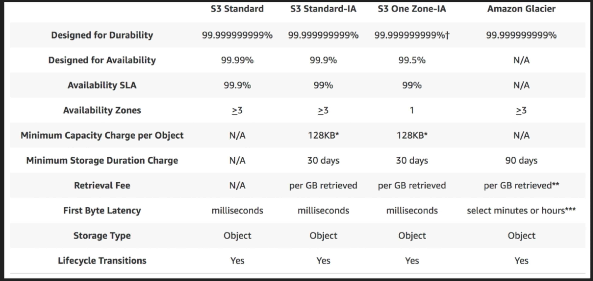
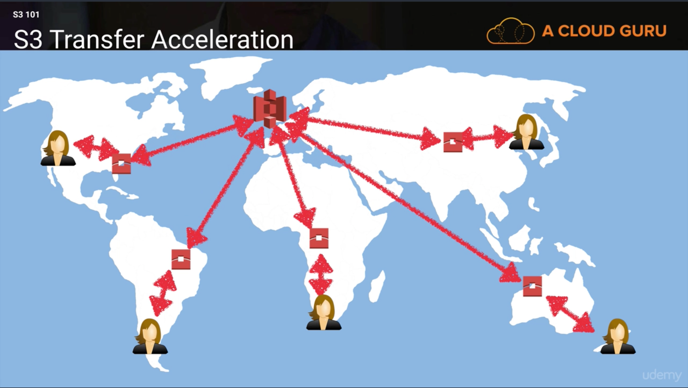

# AWS Object Storage & CDN – S3, Glacier and CloudFront

## S3 (Simple Storage Service)

### Basics
	* S3 is object based storage (NOT block-based)
	* Files can be from 0 Bytes to 5 TB
	* There is unlimited storage
	* Files are stored in Buckets
		* a bucket is a folder in the cloud
		* an S3 bucket has a universal namespace, this is name must be unique globally
				* Bucket handle => https://s3-eu-west-1.amazonaws.com/acloudguru
				* s3-[region].amazonaws.com[your-handle]
	* When you upload a file to S3 you will receive a HTTP 200 code if the upload was successful
	* Built for 99.99% availability for the S3 platform
	* Amazon Guarantee 99.9% availability (SLA - Service Level Agreement)
	* Amazon Guarantees 99.99999999999% durability for S3 information
		* Remember 11 x 9's
		* i.e. you won't loose a file
	* Tiered Storage Available
	* LifeCycle Management
	* Versioning
	* Encryption
	* Secure your data using Access Control Lists and Bucket Policies
	* NOTE: Read through the S3 FAQ before the exam!

### Data Consistency Model

	* Read after write consistency for PUTS of new objects
		* i.e. You can immediatly access NEW stored items in S3
	* Eventual Consistency for overwrite PUTS and DELETES
		* i.e. Can take a few seconds to update or delete PRE-EXISTING files
	* Updates are ATOMIC
		* i.e. You either get the old version or the new version but you never get partial data

### S3 Object Fundamentals

	* s3 is Key-Value based
	* S3 is Object based. Objects consist of the following:
		* Key (This is simply the name of the object)
			* Data in S3 is stored lexographically or alphabetical
			* If you have similar file names like with log data you can add a random letter or number at the begining of the file name in order to more evenly distributed where the files are being stored so you don't get bottlenecks
			* ^ a good practice for design considerations
		* Value (The data, and is made up of a sequence of bytes)
		* VersionID (important for versioning)
		* MetaData (data aboue the data you're storing, ie tags, timestamp, etc)
		* Subresources
			* Access Control Lists (ACL)
				* Lists of who can access data
				* Can be 'per file' or on the Bucket level
			* Torrent

### Object Storage Classes
	* S3 - Standard
		* Availability of 99.99%
		* Durability of 99.999999999%
		* Stored redundantly across multiple devices in multiple facilities and is designed to sustain the loss of 2 facilities concurrently
	* S3 - IA (Infrequently Accessed)
		* Used for data that is accessed less frequently, but required rapid access when needed
			* Ex: Payroll or employee tax data that is only access once a year, but is required immediately when you need it
		* Lower fee than S3, but you're charaged a retrieval fee
	* s3 One Zone - IA
		* when you want a lower-cost option for IA data, but do not require the multiple Availability Zone data resilience
	* Glacier
		* Very Cheap, but used for archival only. Expedidited, Standard, or Bulk.
		* Standard retrieval time takes 3-5 hours, Bulk ~12 hours

### S3 Charges
	* Storage
	* Requests
	* Storage Management Pricing
		* Add tags to control costs
	* Data transfer pricing
		* Data coming into S3 is free, but for example moving data between regions costs you
	* Transfer Acceleration
		* Fast, secure transfers of files over long distances between your users and an S3 bucket
		* Takes advantage of CloudFront's globally distributed Edge Locations
		* User data is uploaded to an edge location near the user and then data is routed to S3 over an optimized network path

### S3 Exam Tips
	* Remember that s3 is a object-based, i.e. allows you to upload files, can store an OS
	* Files can be from 0 Bytes to 5TB
	* There is unlimited storage
	* Files are stored in Buckets
	* s3 is a universal namespace. That is, names must be unique globally
	* https://s3-eu-west-1.amazonaws/acloudguru
	* Read after write consistency for PUTS of new Objects
	* Eventual consistency for overwrite PUTS and DELETES (can take time to propogate)
	* s3 Storage Classes/Tiers
		* s3 (durable, immediately available, frequently accessed)
		* s3 - IA (durable, immediately available, infrequently accessed)
		* s3 One Zone - IA (even cheaper than IA, but only in one availability zone)
		* Glacier - Archived data, where you can wait 3-5 hours before accesing (retrieval time doesn't matter to the user, low cost as possible)
	* Remember the core fundamentals of an s3 object:
		* Key(name)
		* Value (data)
		* Version ID
		* MetaData
		* Subresources
			* ACL
			* Torrent
		* Object based storage (for files)
		* NOT SUITABLE TO INSTALL AN OPERATING SYSTEM
		* If upload is successful s3 returns an http 200 status code
		* Read the FAQ before doing the exam - s3 comes up a lot!!!

### S3 Buckets
	* Buckets are a universal name space.
		* S3 Namespace is global and 'region-less'
	* Succesful object upload to S3 returns an HTTP 200 Code
	* S3, S3 - IA, S3 - RRS
	* Encryption
		* Client Side Encryption
		* Server Side Encryption
			* Server side encryption with Amazon S3 Managed Keys (SSE-SE)
			* Server side encryption with KMS (SSE-KMS)
			* Server side encrytions with Customer Provided Keys (SSE-C)
	* Control access to buckets using either a buck ACL or bucket policies
	* BY DEFAULT BUCKETS ARE PRIVATE AND ALL OBJECTS STORED INSIDE THEM ARE PRIVATE ALSO
	* No upperase letters in bucket names - The name needs to be DNS Compliant
	* You can tag buckets (or any AWS resoruce) to track costs. Tags consist of keys and (optional) value pairs.
	* Max 100 S3 buckets per account by default
	* Individual Amazon S3 objects can range in size from a minimum of **0 bytes** to a maximum of **5 terabytes**.
	* The largest object that can be uploaded in a single PUT is **5 gigabytes**. For objects larger than **100 megabytes**, customers should consider using the Multipart Upload capability.

### S3 Versioning
	* Stores all versions of an object (including all writes and even if you delete an object)
	* A great backup tool
	* Once versioning is turned on it cannot be removed. It can only be suspended. To remove versioning, you have to create a new bucket and transfer all files from old to new
	* To restore a deleted, versioned object -> Delete the delete marker
	* A Version deleted cannot be restored
	* Integrates with LifeCycle rules
	* Versioning considerations:
		* all versions of an object are stored which can increase cost
		* Ex. If you have large files which change frequently, versioning could increase costs dramatically
		* For larger objects, ensure that there is some life cycle versioning in place
	* Versioning's MFA Delete capability, which uses multi-factor auth, can be used to provide an additional layer of security to guard against file deletion
	* For new version of an object, you still have to set permissions to allow access. It is disabled by default even if previous version is public.

### Cross Region Replication

	* To allow for cross region replication, the both source and target buckets must have versioning enabled
	* Regions must be unique
	* Files in an existing bucket are not replicated automatically. Only Updates to existing objects and newer objects are replicated over. All previous versions of the updated objects are replicated in this step.
	* You can choose btw replicating all contents in the source bucket option or just a "Prefix" in the bucket (meaning a sub-folder)
	* Delete Markers are replicated
	* Deleting individual versions or delete markers will not be replicated.
	* If you delete source replication bucket objects, they are deleted from replica target bucket too. When you delete a Delete marker or version from source, that action is not replicated.
	* Understand what Cross Region Replication is at a high level
	* Permissions are also replicated from one bucket to another.
	* You cannnot replicate to multiple buckets or user daisy chaining (at this time)
	* E.g. If you setup bucket C to replicate content from bucket B which replicates content from bucket A –> Changes made to bucket A will not get propagated to C. You will need to manually upload content to bucket B to trigger replication to C.

## Lifecycle Management

	- Objects stored in Glacier incur minimum 90 day storage cost.

	- Lifecycle management can be used in conjunction with versioning

	- Objects can be transitioned to S3-IA after 30 days and to Glacier class storage - 30 days IA.

	- You can also permanently delete objects.

## CloudFront CDN Overview

### Important terms

	- CDN – collection of distributed servers where the content is served to users based on the user’s location and the location of content origin.

	- Edge location – location where content will be cached. Different from AWS Region / AZ

	- Origin – Can be S3 Bucket, an EC2 Instance, an Elastic Load Balancer or Route53

	- Distribution – is the name given to CDN collection which consists of Edge locations.

	- Web Distribution – Typically used for websites & web content only.

	- RTMP – Used for Media Streaming. Adobe Flash media server’s protocol – video streaming.

	- First request is slow as it comes from source origin. Subsequent requests improve speed as they are cached in nearest edge location and routed there until TTL expires.

	- CloudFront also works with non AWS origin which can be on premise as well. .

	- Edge locations are for read and write as well. Objects PUT on edge location are sent to origin

	- Objects are cached for life of TTL. TTL can be set for 0 seconds to 365 days. Default TTL is 24 hours. If objects change more frequently update the TTL

	- You can clear cached objects, with charges.

	- Origin domain name – either S3 bucket, ELB or on premise domain

### CloudFront Security.

	- You can force them to use CDN URL instead of S3 DNS

	- To restrict bucket access you need to create origin access identity. And allow this user read permission S3 bucket content –

	- Set video protocol policy – redirect http to https, http or https

	- Allows various HTTP methods – GET, PUT, POST, PATCH, DELETE, and HEAD.

	- Restrict viewer access for S3 and CDN using pre-Signed URLs or Signed cookies. E.g. You can view video only using that URL

	- Using Web Application Firewalls to prevent SQL injection, CSS attacks

	- For https access, you can either use default CloudFront certificate or own certificate can be imported via ACM.

	- Provisioning / Updating CloudFront distribution takes up to 15-20 minutes.

	- Geo-restriction can be setup. Either whitelist or blacklist – countries from where content can be accessed.

	- Invalidating removes objects from CloudFront. It can be forced to remove from Cache – obviously costs.

	- You can force users to get content via CloudFront after removing read access to S3 bucket.

	- You can also upload content to CloudFront.

## S3 Security & Encryption

### Security

	- By default all newly created buckets are Private

	- Control Access to buckets using

			- Bucket Policies – bucket wide.

			- Access Control Lists – up to individual objects.

	- S3 buckets can log all access requests to another S3 bucket even another AWS account.

### Encryption

	- In Transit

Secured using SSL/TLS

	- Data at rest

1. Server Side

		1. S3 Managed Keys – SSE – S3

		2. AWS KMS Managed Keys – SSE – KMS – Envelop Key. Provides audit trail

		3. SSE using customer provided keys. Key Management is responsibility of user. SSE-C

2. Client Side

Encrypt data at client side and then upload to S3.

## Storage Gateway

	- It is a service which connects an on-premises software appliance (virtual) with cloud based storage to provide seamless and secure connectivity between the two. Either via internet or Direct connect.

	- It can also provide connectivity from EC2 instance in VPC to S3 via Storage Gateway in same VPC

	- The virtual appliance will asynchronously replicate information up to S3 or Glacier

	- Can be downloaded as a VM – VMware ESXi / Hyper-V.

	- 4 Types of Storage Gateways.

 1.[Brand New] *File Gateway (NFS) – Just store files in S3 – Word, Pictures, PDFs, and no OS. ( Saves a lot of money)
	-Files are stored as objects in S3 buckets and accessed over NFS mount point
	-File attributes as stored as S3 object metadata.
	-Once transferred to S3, standard S3 features apply to all files.

 2.Volumes Gateway (iSCSI) – uses block based storage – virtual hard disk, operating system.
	- Stored Volumes – Store entire data set copy on-prem. Data async backed up to AWS S3.
	- Cached Volumes – Stored only recently accessed data on-prem. Rest on AWS S3

	Volume gateway interface presents applications with disk volumes using iSCSI protocol. They take virtual hard disks on premise and back them up to virtual hard disks on AWS. Data written to these volumes can be asynchronously backed up as point in time snapshots of volumes and stored in cloud as EBS snapshots.

 3.Gateway Virtual Tape Library (VTL) – Backup and Archiving solution. Create tapes and send to S3. You can use existing backup applications like NetBackup, Backup Exec, and Veam etc.

## Snowball

Next version of Import / Export Gateway

You could accelerate moving large amounts of data into and out of AWS using portable storage devices for transport. Ship the storage device – no need to transfer over the internet.  Problem arose with different types of disks

### Snowball Standard
	- Bigger than briefcase sized storage devices
	- Petabyte scale data transport solution used to transfer data in/out of AWS
	- Cost is 1/5th as compared to transfer via high speed internet.
	- 80TB snowball available.
	- Multiple layers of security to protect data. Tamper resistant enclosure, 256-bit encryption
	- Once data is transferred, AWS performs software erasure of Snowball appliance.

### Snowball Edge
	- 100 TB data transfer device which has onboard storage and compute capabilities.
	- Move large amounts of data in and out of AWS, as a temporary storage tier for large local datasets.
	- You can run Lambda functions.
	- Devices connect to existing applications and infrastructure using standard storage interfaces.
	- Snowball Edges can be clustered together to process your data on premise

### Snowmobile
	- Massive 45 foot long ruggedized shipping container, pulled by a truck.
	- Petabyte or Exabyte of data that has to be transferred to AWS. 100 PB per snowmobile.
	- You can use it for data center migration.

Using snowball – Import / Export S3. If using Glacier first need to import into S3 and then into Snowball.

## S3 Transfer Acceleration

It utilizes the CloudFront Edge Network to accelerate uploads to S3. Instead of uploading directly to S3, you can use a distinct URL to upload directly to an edge location which will then transfer to S3 using Amazon’s backbone network.

The farther you are from S3 bucket region the higher is the improvement you can observe using S3 Transfer Acceleration. High cost for usage than standard S3 transfer rates.
