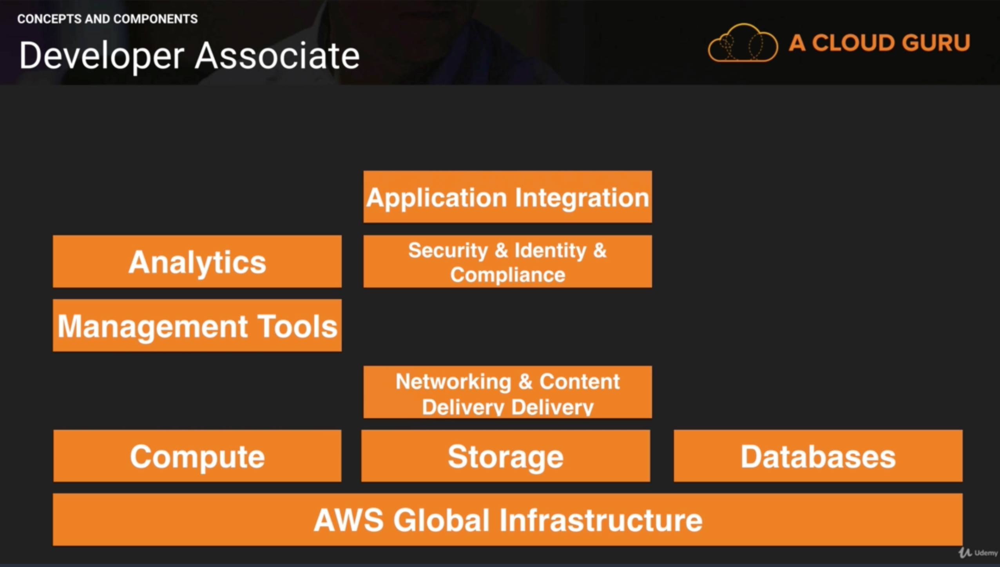
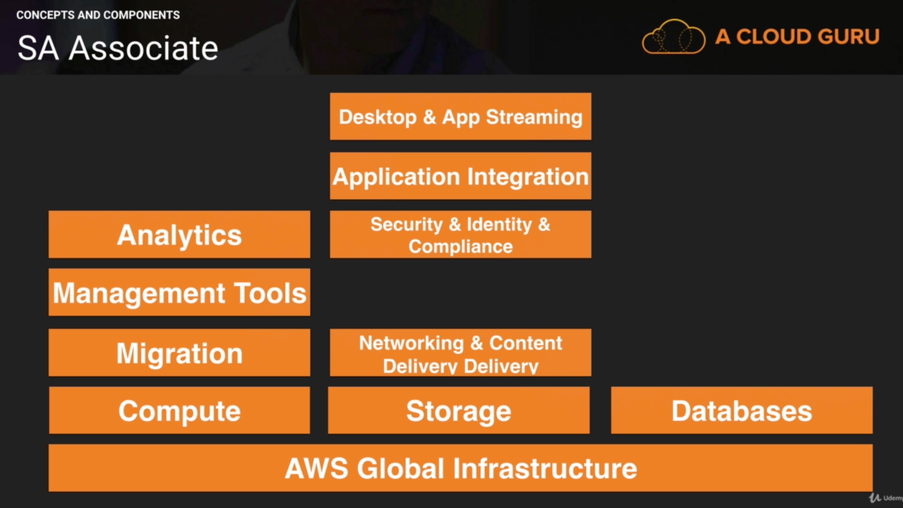
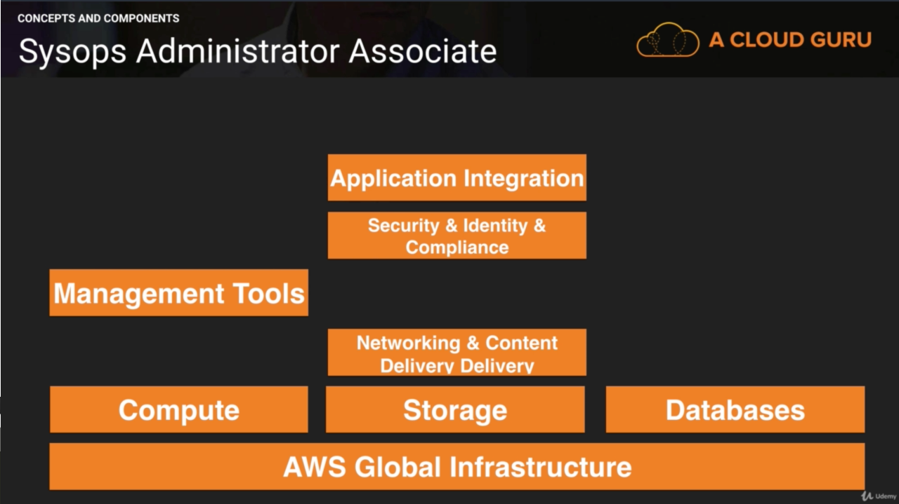

# AWS 10,000 Feet Overview

## Global Infrastructure

	- A Region is geographical area consisting of 2 or more availability zones.
	- Availability zone is logical data center
	- Edge Locations are enpoints for AWS which are used for caching content. Typically this consists of CloudFront, Amazon's CDN. Many more edge locations exist than regions.

## The AWS Platform

### Compute 

	- EC2 – Elastic Compute Cloud.
	- EC2 Container Services – supports Docker.
	- Elastic Beanstalk (important for developer exam). Just upload your code here. Elastic Bean stalk will provision all infrastructure required.
	- Lambda - Code that uploaded and it executes
	- Lightsail – Out of the box cloud – WordPress, Drupal
	- Batch - Batch compute in the cloud (Not currently coverved)

### Storage

	- S3 - Object Store
	- EFS (Elastic File Service) - Block Store - can be used for storing databases. It can be attached to multiple EC2 instances.
	- Glacier – Archive files from S3 into Glacier – use when you don’t need immediate access to files
	- Snowball - Transfer files to a physical disc
	- Storage Gateway (VM) - communicates between your data center and S3 storage.

### Databases

	- RDS ( MySQL, PostgreSQL, SQL Server, MariaDB, Aurora)
	- DynamoDB - Non relational DB (important for developer exam)
	- Redshift  - Data warehousing system, business intelligence. Take load off prod DB
	- ElastiCache - Cache things in Cloud in-memory DB (important for developer / architect exam)

### Migration

	- AWS Migration Hub
	- ADS(Application Discovery Service) - Track db dependancies
	- Snowball - Transfer Data - next step over Export Import gateway. Store all your data from enterprise into Snowball and then ship to AWS. Also released Snowball edge – add compute capacity to storage device – so that you can run analytics on top of the huge dataset collected, without having to transfer to cloud. AWS Lambda is supported on Snowball edge.
	- DMS - Database migration services - migrate existing DBs to Cloud, also migrate existing Cloud DBs to other regions. Can migrate from Oracle/MySQL/PostgreSQL/ to Aurora.  
	- SMS - Server migration services - migrate existing VMs on premise to the Cloud -up to 50 concurrent ones.

### Networking & Content Delivery

	- *VPC* [know VPC in and out] – Virtual Data Center. You can have multiple VPCs per region. VPCs can also be connected to each other.
	- Route53 – Amazon’s DNS Service
	- CloudFront – Content delivery network. Stores content closer to users in edge locations where assests are cached.
	- *Direct Connect* – Connect your physical office to AWS using dedicated telephone lines
	- API Gateway - Creating your own api's for your other services to talk to

### Analytics

	- Athena - allow SQL queries on S3. Run queries on csv files in S3 buckets.
	- **EMR** -Elastic Map Reduce - process large amounts of data. Based on Hadoop, Apache Spark. Log Analytics etc.
	- CloudSearch - Managed services provided by AWS
	- ElasticSearch – Search service which uses the Elastic product
	- **Kinesis** - streaming and analysis real time data (important for architect exam). Used for collating large amounts of data streamed from multiple sources
	- **Kinesis Video Streams** - Igest a bunch a video and run processing on it
	- **Data Pipeline** - move data from one place to another. e.g. S3 into DynamoDB and vice versa
	- Quick Sight- BA tools for rich visualizations and dashboards.
	- Glue - Extract, Transform and Load data into new form

### Developer Tools

	- CodeStar - Code collaboration
	- CodeCommit - Source control like GitHub
	- CodeBuild - pay by minute of build & compilation
	- CodeDeploy – deploy code to EC2 instances.
	- CodePipeline – Track code versions in different environments.
	- X-Ray - debugging
	- Cloud9 - IDE

### Management Tools (important for architect exam)

	- **CloudWatch** - monitor performance of AWS environment – standard infrastructure metrics.
	- **CloudFormation** - Infrastructure into Code - document which describes the infrastructure which uses AWS resources.
	- **CloudTrail** - audit usage of AWS Resources. (Important for security exam)
	- **OpsWorks** - automate deployments using Chef and Puppet. Important for sysops exam
	- **Config** - monitors environments and provides alerts for events. E.g. someone creates a security group which is against policy
	- Service Catalog - Catalog used for compliance (usually for large companies)
	- Systems Manager - Manage AWS resources (usually EC2 instances)
	- **Trusted Advisor** - automated tips for cost & performance optimization, security tips, architecture and design
	- Managed Services - handles scaling for you

### Media Services

	- Elastic Transcoder - Resizes media for devices
	- MediaConvert - Create video for broadcast content
	- MediaLive - Live video processing
	- MediaPackage - Prepares and protects media for delivery
	- MediaStore - Storage service optimized for media
	- MediaTailor - Targeted ads in to video

### Machine Learning
	- SageMaker - Deep learning
	- Comprehend - Sentiment analysis
	- DeepLens - AI aware camera that figures out what it's looking at
	- Lex - Powers AI for Alexa
	- Machine Learning (entry level ML - not Deep Learning)
	- Polly - Takes text and turns it into speech
	- Rekognition – Upload a file and tell you whats in it (for photo or video)
	- Amazon Translate - like Google translater
	- Amazon Transcribe - Auto speech recognition

### Security & Identity & Compliance

	- **IAM** – Important for all AWS exams. How you setup and assign users / groups etc.
	- Cognito - Temp authenitcation service for mobile devices
	- GuardDuty - Moniters for malaicious events on your AWS services
	- **Inspector** - Agent which inspects your VMs and does security reporting. Can be scheduled periodically.
	- Macie - Scan S3 buckets and alerts you if any personal info is contained in them(SSN's etc)
	- **Certificate Manager** – free SSL certs for your domain names.
	- **CloudHSM** - Hardware Security Moniter - Dedicated bits of hardware to store encryption keys
	- **Directory Service** - Integrating your active microsoft directly into AWS (important for architect exam)
	- **WAF** - Web Application Firewall. Allows application level protection. Different from traditional network level firewalls. You can inspect headers / content
	- **Shield** - DOS mitigation
	- Artifact - Download and inspecting AWS compliance reports (PCI etc)

### Mobile Services
	- Mobile Hub - Configures AWS backend for mobile services
	- Pinpoint - Targeted push notifications for mobile users
	- AWS AppSync - Automatically updates user data from web and mobile or offline
	- Device Farm - Testing on devices
	- Mobile Analytics

### AR/VR

	- Sumerian - Allows you to use a common set of tools for AR, VR, and Web 3D

### Application Integrations

	- Step Functions – Way to manage your different lambda functions
	- Amazon MQ - Message Queue (like RabbitMQ)
	- **SNS** – Notify by email / text messages/ http-end points (ie Billing Alarm)
	- **SQS** - Post messages to Queue. De-couple your applications.
	- **SWF** - Simple Workflow Service. Used in Amazon fulfillment center.

### Customer Engagement
	- Connect - Dynamic customer engagement
	- **Simple Email Service** - Send large amounts of email

### Business Productivity

	- Alex for Business - "Alex order toner for the printer"
	- Chime - Video conferencing
	- **Work Docs** - Dropbox for AWS
	- WorkMail - Gmail for AWS

### IoT

	- iOT
	- iOT Device Management
	- Amazon FreeRTOS
	- Greengrass

### Desktop and App Streaming

	- WorkSpaces - Run a Windows desktop on the cloud
	- AppStream 2.0 - Run a app in the cloud and stream to your desktop

### Game Development
 - GameLift

## 10,000 Overview by Exam

